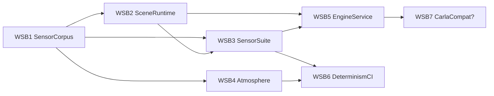

# Native Renderer Production Plan — Bevy as `--engine native`

Status: proposed 2026-08-22. Builds on the GO verdict in
`scripts/renderer-spike/FINDINGS.md` (4.33 ms/frame RGB+ID+Depth @736×416,
bit-identical sha256 across runs, 165-ID legend verified, ~50× the Chrome path).

## North star

One deterministic native renderer that covers the full CARLA application
surface for our stack — sensor simulation, dataset generation, closed-loop
observation rendering, qualification capture — while beating CARLA on the two
axes it can never win: **byte-reproducibility** and **speed on authored
long-tail content**.

Architectural spine: the renderer is a **new engine behind the existing
`packages/render-runtime` contract** (`uniscenarios render run --engine
native`), a peer of `browser`, subject to the same render-intent hashing,
artifact contracts, scheduling, and worker control. No parallel universe.
Qualification reuses `qualification/eight-camera-conformance.v1.json` and the
18-sensor paired-run program with `native` as a third column beside
browser/CARLA.

## Scope boundary (what "CARLA-related application" means here)

Covered: multi-camera rigs (Pronto 8-cam + chase), depth, semantic seg,
instance seg, lidar, radar, IMU/GNSS, weather/time-of-day, actor rendering,
all 5 maps, batch dataset generation, live closed-loop observation service.
Explicit non-goals: UE content/Blueprint compat, CARLA's PhysX (our engine is
authoritative; WS6 provenance covers physics truth), CARLA's Python `carla`
module API (separate decision — see WSB7).

---

## Workstreams (parallel)

### WSB1 — SensorCorpus: asset pipeline productized
The spike's one-off preprocessing (meshopt decode, dequantize, WebP→PNG via
gltf-transform) becomes a deterministic, checksummed build step.
- `uniscenarios corpus build --map <id>`: dev-assets GLB tiles → decoded
  "sensor corpus" with per-file sha256 manifest; cached, reproducible,
  CI-verifiable. Source root: `dev-assets/<map>/browser/3d/tiles`.
- Vegetation: WebP textures + alpha-cutout materials + sidecar instancing
  matrices in Bevy, with alpha-discard-consistent ID passes (the hard-must
  from the original inventory).
- Tile/LOD selection by camera route (route prewarm) across all 5 maps;
  memory budget per map measured and recorded.
- Exit: all 5 maps render complete (vegetation included) from corpus cache;
  corpus build byte-stable twice from clean state.

### WSB2 — SceneRuntime: actors, transforms, motion vectors
- Actor meshes (vehicles/pedestrians/props) from `packages/prop-catalog`
  geometry with **stable per-actor instance IDs** joined into the same legend
  space as static meshes.
- Scene ingestion, two modes: (a) trace playback — `trace.json.gz` → per-tick
  transforms (dataset generation); (b) live — msgpack scene-diff stream from
  the env-server (closed loop). One scene-state schema for both.
- Exact motion vectors: previous-frame transform buffer per instance, with
  defined spawn/despawn semantics; emitted as a G-buffer target.
- Wheels/orientation/brake-light minimum visual grammar (matches what the
  three.js path shows today); no skeletal animation in v1 (corpus has none).
- Exit: a catalog scenario replays visually complete; motion-vector pass
  validates against finite-difference of GT transforms.

### WSB3 — SensorSuite: every CARLA sensor, deterministic
- Camera rigs: rig definitions from `packages/camera-rig` (Pronto 8-cam +
  trailing chase), per-camera intrinsics/extrinsics/vfov, N cameras in one
  process per the spike's multi-camera scaling result.
- Passes per camera: RGB, Depth32Float raw, semantic-class ID, instance ID,
  motion vectors — one submission, MRT where possible.
- **Lidar**: deterministic beam pattern raycast against the scene BVH (not
  screen-space depth — full 360° coverage), returns with instance ID +
  intensity proxy; matches the carla-bridge lidar export format so existing
  sensor-video tooling replays it.
- **Radar**: ray fan + radial velocity from exact per-instance velocities;
  same forma-parity requirement.
- IMU/GNSS: pure engine-state derivations (no rendering), emitted alongside
  for rig completeness.
- Exit: 18-sensor paired run captured on `native`, added as a column to the
  qualification program; per-sensor artifacts hash-stable.

### WSB4 — RealismStack: UE5-parity lighting, atmosphere, post-processing

Two render profiles from one scene state, selectable per render intent:
- **`sensor`**: linear output, fixed EV100, zero temporal effects — the
  hash-stable profile feeding G-buffers, IDs, and student conditioning.
- **`cinematic`**: the full realism stack below — feeds teacher/translation
  input (W0 showed source realism improves translation) and human review.
  UE5's realism is temporally fused (TSR glues Lumen/VSM noise together);
  temporal history breaks per-frame hash determinism, so it lives ONLY here.

**Lighting foundation (fixes the too-dark shadows — a lighting-model bug,
not a post effect):** the spike used a 12k-lux sun + flat ambient and no
environment light, so shadowed pixels got a constant gray. Ladder, in order:
1. `EnvironmentMapLight` IBL from `env/sky.hdr` — sky-fill in shadows; delete
   the flat GlobalAmbientLight. (~80% of the fix.)
2. Physical light units: ~100k lux clear-day sun + calibrated EV100
   (auto-exposure allowed in cinematic profile only).
3. GTAO (Bevy SSAO) + 0.19 contact shadows — contact-shaped darkening.
4. PCSS soft shadows on the cascades — UE5 SMRT-style penumbra widening.
5. Solari raytraced GI (0.19, improved BRDF/temporal stability) as the Lumen
   analog — quality tier on RT hardware (5080), not the baseline.

**UE5-parity checklist** (Bevy 0.19 status → action):
| UE5 | Bevy | Action |
|---|---|---|
| Lumen GI | Solari + IBL + irradiance volumes | IBL now, Solari tier |
| VSM + SMRT | cascades + PCSS + contact shadows | configure + calibrate |
| TSR/TAA | TAA, DLSS integration | cinematic profile only |
| Auto exposure | AutoExposure built in | cinematic only; sensor = fixed EV |
| Bloom/DoF/motion blur/LUT grading | built in | configure |
| Vignette/lens distortion | new in 0.19 | configure (camera-ness) |
| Film grain | absent | small custom pass (~1 d) |
| Volumetric fog + physical atmosphere | built in (0.18+) | drives weather ladder |
| SSR (wet road, night reflections) | deferred path, experimental | behind flag; reflection-probe fallback |
| Nanite | meshlets experimental | skip — 4M tris total |

**Weather ladder** as engine-native lighting/participating media: clear, fog
(volumetric + sky attenuation), rain (wet-road reflectance ramp + SSR),
night (light temperature + streetlight emissives) — driven by the scenario's
weather field, not post-hoc overlays (the W0 failure mode).

**Calibration & validation:** side-by-side vs W0 clips and real dashcam
footage; frozen-detector visibility sanity (fog actually occludes); WS1
bridge-fidelity scorecard on cinematic frames vs the real corpus as the
objective realism metric.

Exit: weather/time-of-day ladder of one scene passes review; shadowed areas
carry sky-tinted fill validated against reference; cinematic profile scores
measurably closer to real-corpus detector statistics than the spike output.

### WSB5 — EngineService: contract integration + closed-loop serving
- Implement the `render-runtime` engine interface: render-intent → native
  invocation, artifact + hash contracts identical to browser engine;
  `render run --engine native` end-to-end from the CLI.
- Long-lived render service: map prewarmed once, then (scene-state, rig) →
  frame sets at per-frame cost; shared-memory ring buffer handoff to the
  gym adapter (zero-copy into numpy); PNG demoted to async export.
- Batch dataset API: N poses/ticks → N×(all passes) with a resumable ledger,
  same JSON-first CLI conventions as `batch`.
- services/render-worker grows a native lane beside the browser lane.
- Exit: gym env steps with native observations; batch job renders a full
  catalog scenario's clip faster than real time end-to-end.

### WSB6 — DeterminismCI: hashes, goldens, perf regression
- Golden-hash-per-GPU policy: evidence manifest {pass hashes, GPU, driver,
  wgpu/Bevy versions, corpus checksums}; goldens stored per fingerprint.
- Regression suite: render golden scenes on every change → hash-compare;
  perf budget assertions (frame-time ceilings per resolution/pass-set).
- Runs in CI on the 5080 box (self-hosted runner) since A100 raster is
  unrepresentative; document the fingerprint policy in
  `docs/determinism-claim.md` (WS4 owns the claim doc; this workstream wires
  enforcement).
- Exit: CI red on any pixel drift or >10% frame-time regression.

### WSB7 — CarlaCompat (decision gate, not default)
A thin Python `carla`-API facade (client/world/actor/sensor surface) over the
env-server + native render service, so CARLA ecosystem tools (scenario_runner,
existing perception stacks) run against UniScenarios unmodified. High
adoption leverage, ~2–3 weeks, zero engine work — but only worth it if
external/ecosystem use is a goal. Ship after WSB3+WSB5 if greenlit.

---

## Dependencies & sequencing

WSB1 unblocks everything and starts alone-first (days, not weeks — the spike
scripted most of it). WSB2/3/4 run fully parallel after corpus lands; WSB5
integrates; WSB6 hardens continuously. Spike estimate for the core
(WSB1–WSB5 minus lidar/radar) was ~3–4 engineer-weeks; lidar/radar and CI add
~1–2 more.

## Program-level acceptance

1. `uniscenarios render run --engine native` produces the full sensor set for
   any catalog scenario on all 5 maps, hash-stable per GPU fingerprint.
2. 18-sensor paired qualification passes with `native` as a first-class
   column.
3. Gym closed loop runs on native observations at ≥100 env-steps/s with
   rendering no longer the bottleneck.
4. Chrome path demoted to presentation/cinematic duty only.
