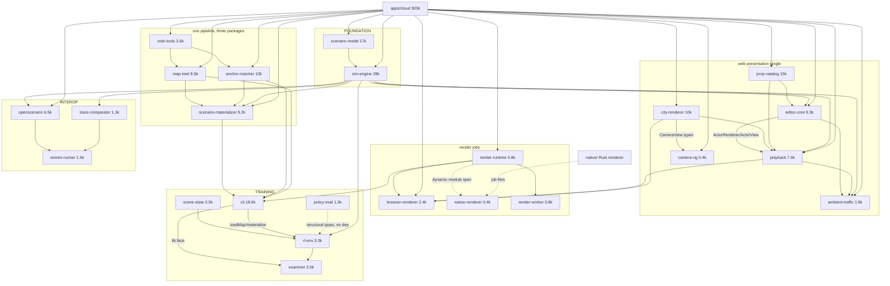

# UniScenarios → SimForge: Consolidation Analysis

**Verdict up front:** the workspace has 24 TS packages but only about 8 real systems. Roughly half the packages are arbitrary splits of a system that is only ever consumed whole. The rebrand plan (docs/simforge-rebrand-plan.md) renames 24 packages to 24 packages — it spends the one cheap breaking-change window (the §6 major stack release SimCloud must absorb anyway) on names alone and enshrines every wrong boundary under a prettier name. Merge to **13 packages / 8 systems** in the same window. Two structural facts make consolidation nearly free: (1) **every package versions in lockstep** (`0.1.0-rc.45` across the stack, one `stackVersion` in config/uniscenarios-stack.json) — there is no per-package release cadence to preserve; (2) SimCloud consumes the stack as one atomic vendored set (21 npm entries + 2 PyPI in stack-lock), and §6 already plans a rename manifest — a merge manifest is the same mechanical change.

---

## 1. Inventory (code-grounded)

LOC = real source lines (excl. node_modules/dist/.next/.venv). Dependents = actual `import` statements found in the repo, **after** discounting `apps/studio` + `editor-ui`, which the plan deletes (correctly). "Vendored" = listed in config/uniscenarios-stack.json → SimCloud stack-lock.

| Package | LOC | Exports (index) | Real dependents | Vendored | Verdict |
|---|---|---|---|---|---|
| scenario-model | 17,488 | 26 stmts (5 star) | 13 pkgs + cloud — universal | yes | **Load-bearing.** The format. Keep alone. |
| sim-engine | 27,702 | 93 | 10 pkgs + cloud | yes | **Load-bearing.** The determinism moat. Keep. |
| xodr-tools | 3,650 | 10 | anchor-matcher, map-intel, cloud | yes | Arbitrary split — stage 1 of one map pipeline. |
| map-intel | 8,909 | 26 | cli, materializer, cloud | yes | Arbitrary split — stage 2, same consumers. |
| anchor-matcher | 10,123 | 19 | cli, examiner, materializer, cloud | yes | Arbitrary split — stage 3; never used without materializer/map-intel. |
| scenario-materializer | 9,153 | 11 (10 star) | cli, cloud | yes | Load-bearing *function*, wrong *boundary*: the scenario→world compiler, split from its own matcher. |
| prop-catalog | 15,366 | 15 | editor-core, playback, materializer, cloud | yes | **Load-bearing.** Cohesive parametric asset library + 45KB catalog.json + contact-sheet tooling. Keep. |
| city-renderer | 10,275 | 29 | browser-renderer, camera-rig, playback, cloud | yes | Load-bearing (three.js viewport) but entangled: actor presentation it needs lives in editor-core. |
| camera-rig | 415 | 7 | cloud only | yes | **Not a package.** 6 files, one consumer, type-level dep on city-renderer. Fold. |
| editor-core | 9,281 | 16 star | ambient-traffic, playback, cloud | yes | Mislabeled: contains `ActorRenderer`/`ActorView` (3D actor presentation) that *runtime* packages import — the editor is upstream of playback, which is inverted. |
| editor-ui | 16,693 | 16 | apps/studio only | yes | **Dead walking** — plan deletes it. Correct. But it IS in the vendored set (role `editor-presentation`); deletion is itself a SimCloud break the plan doesn't flag. |
| playback | 7,586 | 19 star | ambient-traffic, browser-renderer, cloud | yes | Load-bearing (replay half of editor==sim==replay) but imports editor-core for actor types — inverted layering. |
| ambient-traffic | 1,763 | 7 star | cloud only | yes | **Feature module, not a system.** 14 files of SUMO provider contracts + smoothing, depends on editor-core+playback+engine. Fold. |
| openscenario | 6,539 | 4 (1 star) | cli, esmini-runner, playback, cloud | yes | Load-bearing (ASAM import/export, browser-safe + ./node subpath). Nucleus of an interop system. |
| esmini-runner | 1,469 | 9 star | **nobody** (1 integration-test script) after studio dies | yes | Vestigial as a package; alive as conformance tooling. Fold into interop. |
| trace-comparator | 1,288 | 4 | esmini-runner only | yes | Single-consumer. Exists to prove our trace == esmini trace. Fold into interop. |
| render-runtime | 797 | 9 star | browser-renderer, cli, native-renderer, render-worker, cloud | yes | 797 LOC of contracts split from both engines that implement them. Arbitrary split. |
| browser-renderer | 2,396 | 18 star | cloud only | yes | Single-consumer web capture engine. Fold. |
| native-renderer | 410 | 3 | **zero static importers** — loaded dynamically via `UNISCENARIOS_NATIVE_ENGINE_MODULE ?? '@uniscenarios/native-renderer'` (render-runtime/builtin-engines.ts); `private: true`, not vendored | no | **Not a package.** A 410-LOC adapter module for the Rust renderer. Fold. |
| cli | 18,649 | 23 | examiner, rl-env (+ SimCloud as a *library*, role `cli-and-openscenario`) | yes | Two things in one: the `uniscenarios` binary AND the de-facto stack loader library (`loadMap`, `materialize`, `readTemplate`, `findSite`) that rl-env/examiner/SimCloud import. Libraries depending on a CLI is the worst layering violation in the repo. Split the lib face out; keep the binary. Note: ~half its 90 files are runtime integration tests for the whole stack. |
| rl-env | 3,312 | 11 | examiner (+ gym adapter over the wire) | yes | **Load-bearing** (Gymnasium-semantics env + causal ground-truth channel). Keep; sever the dep on cli. |
| scene-state | 517 | 3 | rl-env; format also consumed by gym (Python) and native/sensors (Rust) | no | **Not a package.** The engine's trace→scene-state.v1 emitter. Cross-language consumers depend on the *format*, not the npm name. Fold into engine. |
| policy-eval | 1,291 | 5 | none statically — tools/policy-eval-runner (Python) invokes `dist/eval-server.js` by path; deliberately zero workspace deps via structural typing (runtime.ts documents this as a split-worktree workaround) | no | Load-bearing *protocol* (frozen suite + hash-keyed reports), package boundary justified by a temporary worktree process, i.e. historical accretion. |
| examiner | 2,629 | 18 | **nobody** | no | Research harness (WS2 faithfulness critic), version `0.1.0-alpha.1`, not vendored. Doesn't belong in the published stack at all. |
| render-worker (services/) | 767 | 4 star | deploy artifact | yes | Keep as a thin deployable; it's a service, not a library. |

**Non-TS units:** `native/` Rust workspace — render-core 5.3k (headless Bevy renderer, 3 bins), sensors 2.7k (CARLA-surface sensor suite, scene-state.v1 consumer), service 1.4k (unix-socket render service). Genuine language boundary, internal crate split is healthy. `adapters/uniscenarios-gym` ~950 real Python LOC (Gymnasium client over the env-server wire protocol; vendored to PyPI). `adapters/carla-bridge` ~10.2k real Python LOC (runs UniScenarios scenarios in real CARLA; vendored). `adapters/carla-compat` 3.8k Python (an `import carla` **facade over our engine** — the opposite direction from carla-bridge; not vendored). `apps/cloud` ~303k TS — the ported SimCloud product app (Studio), including 63k of `simcloud-shared` and 59k of `scenario-editor`+`uniscenario` libs that partially duplicate package code (the same paths SimCloud's own integration config lists as `forbiddenPaths`). `tools/` is mixed: golden-harness + render-determinism are **CI qualification tooling** (native-golden.yml runs `tools/golden-harness/golden.mjs verify`), the rest (bridge-*, vla-posttrain, realism-ablation, physics-oracle, policy-eval-runner) are research/eval runners.

## 2. Dependency reality

**Findings:**
- **Only-consumed-together sets (merge candidates):** {xodr-tools, map-intel, anchor-matcher, scenario-materializer} — one compile pipeline, identical consumer set (cli, cloud, SimCloud). {render-runtime, browser-renderer, native-renderer} — a contract and its two engines. {openscenario, esmini-runner, trace-comparator} — export + run-in-esmini + compare-traces is one conformance story.
- **Inverted/tangled:** playback and ambient-traffic import `ActorRenderer`/`ActorView` from **editor-core** — the replay runtime depends on the editor. No hard cycle, but the actor-presentation contract lives in the wrong package. `rl-env` and `examiner` import `loadMap/materialize/readTemplate` from **cli** — libraries depending on the binary's package.
- **Historical accretion:** policy-eval's zero-dependency structural-typing design exists (per its own runtime.ts comment) because hardening lanes branched from main before rl-env WIP landed — a worktree-process constraint fossilized as a package boundary. scene-state exists as a package so a split worktree could consume the emitter; its real consumers are cross-language and depend on the format. editor-ui + apps/studio are a superseded editor generation.
- **Single-consumer packages:** camera-rig→cloud, browser-renderer→cloud, ambient-traffic→cloud, trace-comparator→esmini-runner, scene-state→rl-env, esmini-runner→(nothing but a test script). Six packages with ≤1 real consumer each.
- **Zero-importer packages:** native-renderer (dynamic-load only), examiner, policy-eval (invoked by path from Python).

## 3. Consolidation proposal — 8 systems, 13 npm packages

| # | System (one-line responsibility) | Packages | Absorbs (old → new home) |
|---|---|---|---|
| 1 | **Scenario** — the portable scenario document, versioned & framework-free | `@simforge/scenario` | scenario-model (rename only) |
| 2 | **Engine** — deterministic fixed-step simulation kernel + its trace formats | `@simforge/engine` | sim-engine; **+ scene-state** as `engine/scene-state` (it's the engine's trace serialization; Python/Rust consumers use the format, not the npm name) |
| 3 | **World** — everything that turns OpenDRIVE + a scenario into a concrete simulatable world | `@simforge/maps` (xodr-tools + map-intel: parse, georeference, build map intelligence — no scenario knowledge) and `@simforge/compiler` (anchor-matcher + scenario-materializer + **the lib face extracted from cli**: `loadMap`, `readTemplate`, `matchAnchor`, `materialize`, `findSite`) | 5 packages → 2 |
| 4 | **Studio runtime** — authoring document, 3D viewport, deterministic replay, asset library | `@simforge/viewer` (city-renderer + camera-rig + **ActorRenderer/ActorView moved here from editor-core**, fixing the playback→editor inversion), `@simforge/editor` (editor-core minus actor presentation), `@simforge/playback` (playback + ambient-traffic as `playback/traffic`), `@simforge/asset-catalog` (prop-catalog, rename only) | 6 packages → 4; editor-ui deleted |
| 5 | **Rendering** — render-job contract and every engine that fulfills it | `@simforge/render` (render-runtime at root + browser-renderer as `render/web` + native-renderer shim as `render/native`; subpath exports keep the root dependency-light and engines lazy-loaded) + `services/render-worker` kept as thin deployable + `renderer/` (Rust workspace, was native/ — genuine language boundary, crates stay) | 3 packages → 1 (+1 service, +1 Rust workspace) |
| 6 | **Interop** — ASAM OpenSCENARIO import/export and third-party-runner conformance | `@simforge/openscenario` (openscenario + esmini-runner as `openscenario/esmini` + trace-comparator as `openscenario/trace-diff`; docker/node code stays behind the existing ./node-style subpath) | 3 → 1 |
| 7 | **Training & evaluation** — Gymnasium-semantics env, causal ground truth, frozen eval protocol | `@simforge/training-env` (rl-env, dep on cli replaced by dep on compiler), `@simforge/evaluation` (policy-eval + examiner — both unvendored ground-truth harnesses driven by Python runners; keep policy-eval's dynamic runtime loading until the hardening lanes are confirmed landed) | 4 → 2 |
| 8 | **CLI** — the `simforge` binary; orchestration and the stack's integration-test surface | `@simforge/cli` (minus the extracted lib face; its large runtime test suite explicitly becomes the stack integration suite) | rename + shrink |

Plus: `studio/` (apps/cloud, the product app), `adapters/gym`, `adapters/carla-compat` + `adapters/carla-bridge` (Python, see critique §4 — do NOT merge these two), `research/` (tools/bridge-*, vla-posttrain, realism-ablation, physics-oracle, policy-eval-runner), and `qualification/` gains tools/golden-harness + render-determinism (they are CI gates wired into native-golden.yml, **not** research — the plan's blanket `tools/* → research/` is wrong for them).

**Weighing the forces:**
- *Release/vendoring:* lockstep `rc.45` versioning proves there is exactly one release cadence. 21 vendored tarballs → ~13. SimCloud's Phase-3 swap is one mechanical import sweep either way; a rename-only release and a rename+merge release cost SimCloud the same one change. Doing renames now and merges later costs SimCloud **two** breaking syncs — the strongest argument for merging in this window.
- *Incremental builds:* largest post-merge package is still sim-engine (27.7k, unchanged). Merged packages land at 9–19k LOC — smaller than sim-engine already is. No build-granularity loss that matters; subpath exports preserve tree-shaking.
- *API blast radius:* lockstep versioning already couples all APIs; a change anywhere bumps everything. The only boundaries worth protecting with separate packages are: **scenario** (format stability — everything depends on it), **engine** (the moat: editor==sim==replay byte-for-byte; its boundary is what makes the determinism claim auditable), **asset-catalog** (content cadence: catalog.json + generated art churns independently of code), **maps vs compiler** (maps has scenario-free consumers: overlay rendering in Studio uses xodr layers without materializing), **training-env** (the wire-protocol contract the Python gym adapter mirrors), and **language boundaries** (Rust renderer, Python adapters). Every kept boundary above passes one of: different consumers, different language, different content cadence, or moat-auditability. Nothing else does.

## 4. Critique of the rebrand plan's rename map

1. **It renames 24 packages to 24 packages.** The plan treats granularity as out of scope while §6 schedules the only cheap moment to fix it — a major, manifest-carrying, SimCloud-coordinated release. Renaming `anchor-matcher→retargeting`, `scenario-materializer→materializer`, `xodr-tools→opendrive`, `map-intel→maps` mints four permanent names for what the dependency graph shows is one pipeline with one consumer set. Half of §3's rows become moot under consolidation (retargeting, materializer, traffic, trace-diff, web-renderer, and the "unchanged" scene-state/native-renderer/render-runtime rows disappear as names).
2. **"Already descriptive" is doing a lot of lifting.** `native-renderer` (410 LOC, zero static importers, private:true, not even vendored) and `render-runtime` (797 LOC of contracts) are blessed as "unchanged — already descriptive." They are not descriptive packages; they are modules of one rendering system that got separate package.json files.
3. **`viewer` vs `editor` will actively mislead post-rename.** The plan's naming rule says "viewer = interactive viewport; editor = authoring." But `ActorRenderer`/`ActorView` — 3D presentation — live in editor-core and are imported by playback and ambient-traffic. After the rename, `@simforge/playback` depends on `@simforge/editor`, which reads as nonsense and advertises the inversion. Renaming without moving the actor-presentation contract into viewer bakes the lie into the public API.
4. **`traffic` oversells a 1.7k-LOC provider module** (14 files) whose only consumer is the product app, and whose deps (editor-core + playback + engine) show it's a playback/authoring feature, not a peer system of `engine` and `maps`.
5. **`training-env` keeps depending on `cli`.** The plan renames rl-env to fit the "ML training environment" positioning but leaves it importing `loadMap/materialize` from the CLI package. An outside RL user installing `@simforge/training-env` pulls in the whole CLI. The lib-face extraction is a prerequisite for the positioning the rename claims.
6. **`adapters/carla` conflates two opposite adapters.** carla-compat is `import carla` **over our engine** (SimForge pretending to be CARLA); carla-bridge **executes our scenarios in real CARLA** (vendored to SimCloud as `optional-carla-execution-adapter`). One name for both hides the platform's best marketing fact — that it can replace CARLA *and* drive it. Keep two: e.g. `adapters/carla-api` and `adapters/carla-exec`.
7. **Deleting editor-ui is a SimCloud break the plan files under Phase 1.** editor-ui is in the vendored stack (role `editor-presentation`, in stack-lock rc.45). Its deletion must ride the Phase-2 major release with the rename manifest, not the "repo-internal, no npm impact" phase. Same class of oversight: `verify:naming` and stack manifest must also drop it from `uniscenarios-stack.json`.
8. **`tools/* → research/` is too blunt.** golden-harness and render-determinism are the native renderer's CI qualification gates (native-golden.yml invokes them); policy-eval-runner gates against pinned baselines in qualification/. Moving CI gates into a directory whose stated contract is "nothing here ships in releases" mislabels load-bearing infrastructure.
9. **What the plan gets right (keep):** deleting apps/studio + editor-ui; the Rust renderer owning the public "SimForge Renderer" name; `studio/` promoted to top level; not renaming DB schemas/wire paths; the three-phase SimCloud release choreography; `opendrive`/`openscenario` keeping standards' names; the audit step for engine-adjacent modules still living in studio server code (the ~59k LOC of `app/lib/scenario-editor` + `app/lib/uniscenario` duplicating package functionality is real and the audit should be scoped, not "if any").

## 5. Migration cost per merge

| Merge | Mechanical cost | Real risk |
|---|---|---|
| xodr-tools + map-intel → maps | Import rewrites in 3 consumers (anchor-matcher, materializer, cloud) + scripts; both already share test conventions | None found — same consumers, same cadence |
| anchor-matcher + materializer + cli lib face → compiler | Largest sweep: cli, cloud, examiner, rl-env imports; SimCloud imports cli-as-library today (role `cli-and-openscenario`) and must repoint to compiler — but Phase 3 rewrites every SimCloud specifier anyway | policy-eval's Python runner and runtime loader resolve rl-env's modules dynamically; update tools/policy-eval-runner paths and confirm hardening lanes landed before removing the indirection |
| scene-state → engine/scene-state | rl-env import + 1 script; gym (Python) and native/sensors (Rust) consume the format over the wire/files — zero cross-language code change | None; keep the `scene-state.v1` document id frozen (plan already freezes format ids) |
| camera-rig + ActorRenderer(from editor-core) → viewer | camera-rig: trivial (6 files, 1 consumer). ActorRenderer move: type-heavy refactor across editor-core, playback, ambient-traffic, cloud; do it **before** the rename sweep as a reviewed behavioral commit | Moderate — this is the one merge with real code motion; mitigated by types-first nature (mostly `import type`) |
| ambient-traffic → playback/traffic | Imports in cloud only (post editor-ui deletion); SimCloud's ambient UI imports move to the subpath | Low; SimCloud vendored set shrinks by one |
| render-runtime + browser-renderer + native-renderer → render | Imports in cli, cloud, render-worker; update the dynamic default in builtin-engines.ts (`UNISCENARIOS_NATIVE_ENGINE_MODULE` → `SIMFORGE_*`, default `@simforge/render/native`) — env-var rename is already planned | Keep root entry dependency-light (contracts only) so render-worker/SimCloud don't pull three.js; subpath exports enforce this |
| openscenario + esmini-runner + trace-comparator → openscenario | Imports in cli, playback, cloud + 1 integration test; SimCloud vendored set −2 | Docker/exec code must stay out of the browser-safe root (existing ./node subpath pattern already solves this) |
| policy-eval + examiner → evaluation | Python runner invokes `packages/policy-eval/dist/eval-server.js` by path — update tools/policy-eval-runner CLI defaults + qualification docs; neither package is vendored, so zero SimCloud impact | Split-worktree constraint (runtime.ts): merge the packages but keep the dynamic runtime loading until rl-hardening lanes are confirmed merged |
| editor-ui + apps/studio deletion | Plan owns this; add: remove editor-ui from uniscenarios-stack.json and the SimCloud vendor set in the Phase-2 release | Must ship in Phase 2 (major release), not Phase 1 |

**Recommended execution order** (revising the plan's §7 lanes):
1. **R0-Deletions**: delete apps/studio + editor-ui first (plan's R3). Removes ~44k LOC, two packages, and 20+ inbound import edges from every subsequent sweep. Repo-internal except the stack-manifest edit, which is staged for Phase 2.
2. **R0-Seams** (behavioral, individually reviewable, still `@uniscenarios`): (a) extract cli lib face → scenario-materializer's package (the future compiler); repoint rl-env, examiner, studio-server callers; (b) move ActorRenderer/ActorView editor-core → city-renderer; repoint playback, ambient-traffic, cloud. Full test gate after each — these are the only two commits with real regression surface.
3. **R1+R2-Atomic**: one commit: directory merges per §3 above + `@uniscenarios/*` → `@simforge/*` + package dir renames + subpath export maps + lockfile + CLI binary rename. Pure mechanical (ast-grep sweep), gated by build+tests. Merging here is strictly cheaper than renaming twice.
4. **R4-Docs** as planned (with the §4 corrections: tools split between research/ and qualification/, carla adapters kept distinct).
5. **R5-Verify**: full build, package tests, Studio E2E on :5199, `simforge` CLI smoke, native-golden local, verify:naming rewritten to enforce the *merged* layout.
6. **R6-Release**: Phase-2 major release with a combined rename+merge manifest (old name → new name **or** new subpath, one table); SimCloud Phase 3 unchanged in shape — one import sweep against the manifest, stack-lock shrinks 21 → 13 entries.

**Bottom line:** 24 packages → 13; 8 systems an outside contributor can hold in one README: *scenario, engine, maps, compiler, viewer/editor/playback (+assets), render, openscenario, training/evaluation, cli* — plus the Rust Renderer, Studio, and the Python adapters. Every kept boundary is justified by consumers, language, content cadence, or the determinism moat; every dissolved boundary was justified only by history.