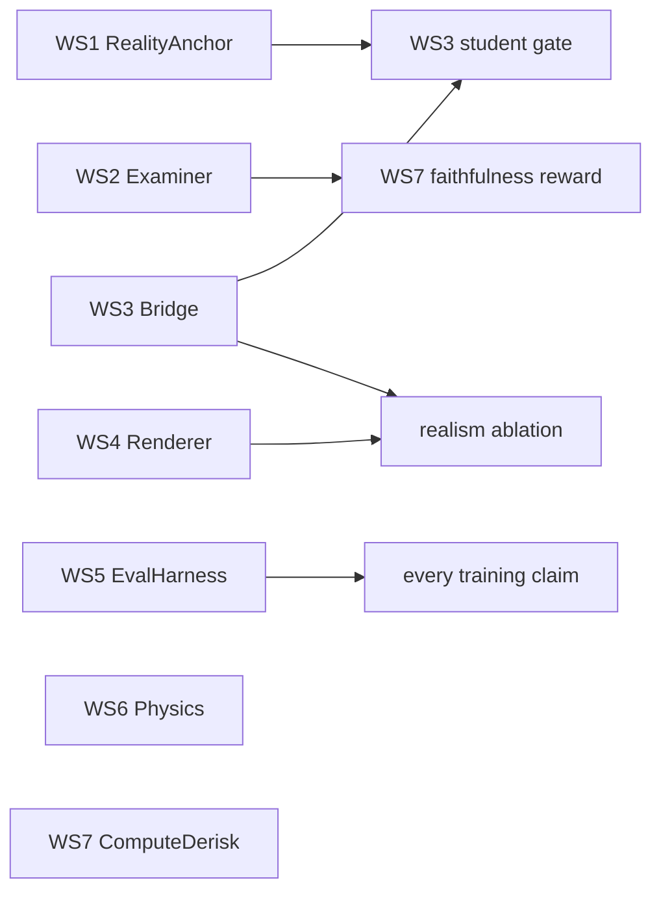

# RL Platform Hardening Plan — parallel workstreams
> **Historical plan:** Pre-rebrand package and tool paths are retained
> verbatim below.

Status: proposed 2026-08-22. Addresses the eight gaps from the platform critique:
no real-world anchor, unspecified faithfulness critic, H3 semantic-binding risk,
unmeasured realism requirement, GPU-determinism scope, golden-maneuver provenance,
license/compute externalities, missing frozen eval protocol.

Each workstream is independently executable. Cross-stream contracts are stated
explicitly; only WS7's *full* reward depends on WS2's grader.

---

## WS1 — RealityAnchor: ground the bridge in real data

**Problem.** The student-vs-teacher gate proves student ≈ teacher, never
teacher ≈ reality. Literature says global generative metrics (FID/KID) do not
predict downstream utility; detector-based paired metrics do
(arXiv 2606.19817 training-free detection-utility metrics; 2411.07375 Instance
Performance Difference; 2602.18525 FID↛mAP; 2208.01022 perception-contextual
camera validation).

**Work.**
1. Assemble a fixed real eval corpus: ~2–5k dashcam frames / 50 clips from
   Waymo Open + nuScenes (research licenses permit eval use), stratified to
   match our scenario classes (dart-out, cut-in, intersection, weather, night).
2. Freeze one perception stack (e.g. YOLO11 + a depth model) as the metric
   instrument — versioned, never retrained.
3. Metrics, in authority order: (a) detector AP/recall delta between translated
   frames and matched real frames (IPD-style pairing on scene attributes);
   (b) per-class hallucination/deletion rate vs engine ground truth;
   (c) FID as a tie-breaker only.
4. Wire as a CI-style gate: every student checkpoint gets a bridge-fidelity
   scorecard against the real corpus; regression blocks promotion.

**Deliverable.** `packages/bridge-fidelity` + corpus manifest + first scorecard
for the current H3/W0 outputs. **Gate:** translated-frame detector agreement
within a fixed band of real-frame performance on matched scenes.

## WS2 — Examiner: the faithfulness critic, specified and validated

**Problem.** The novelty claim (train reasoning against engine causal ground
truth) has no grader design. Faithfulness metrics themselves are unreliable
unless validated on cases with *known* ground truth (2605.25052 meta-eval);
the working pattern is controlled perturbations with known error positions
(FACT-E 2604.10693; C2-Faith 2603.05167) and counterfactual/SCM audits
(Ariadne 2601.02314).

**Work.**
1. Define a versioned **claim schema**: reasoning must be parseable into typed
   propositions over engine state — visibility(actor, t-interval),
   causal-trigger(event→event), intent(actor), spatial relations. The engine
   already emits the causal frame per step (`rl-env` `info.causal`).
2. Build the grader two-layer: deterministic checkers for propositions the
   engine can verify directly; a constrained LLM extractor only for NL→schema
   parsing (never for truth judgment).
3. **Grader benchmark before any RL:** generate a perturbation set where the
   engine *knows* the injected error (swap occlusion state, reorder triggers,
   delete a pedestrian from the description) → grader must recover known error
   positions. Add ~200 human-labeled samples. Decompose scores into causality
   and coverage (C2-Faith).
4. Anti-reward-hacking by construction: reward core stays programmatic
   (outcome + deterministic checkers); the learned extractor is audited with a
   hacker/auditor red-team loop (ARA 2602.01750) and an information-bottleneck
   style spurious-feature check (InfoRM 2402.09345) before its signal gets any
   reward weight.

**Deliverable.** Claim schema doc + grader package + grader benchmark report
(precision/recall on known-error set). **Gate:** ≥90% recovery of injected
errors, human agreement measured, before the grader touches a reward.

## WS3 — Bridge: student conditioning hardening + teacher derisking

**Problem.** H3's semantic-binding drift (intersection-spawn) is unresolved;
teacher licensing for distillation is unverified; the student recipe needs
committing.

**Work.**
1. **Condition authority moves to the student.** Train the student with dense
   multi-modal conditioning from our renderer (depth + semantic + instance
   G-buffers), the pattern of MoVieDrive (2508.14327), CoGen (2503.22231),
   Panacea (2311.16813). Teacher output is a *style target*; geometry is pinned
   by our G-buffers, so teacher drift cannot relocate the ego.
2. Adopt ACD-style condition-adherence supervision (2512.21268) if drift leaks
   through; keep the frozen-perception auto-auditor as the hard reject.
3. **Distillation recipe:** few-step autoregressive student via DMD/CausVid
   (2412.07772) upgraded to frame-wise 1–2-step (Causal Forcing++ 2605.15141)
   for the interactive loop; DOLLAR/AnyFlow (2412.15689, 2605.13724) as
   fallbacks. Target ≤35 ms/frame @480p, ≤10 GB.
4. **Teacher decision (updated 2026-08-23):** H3 (MiniMax) is the only video
   model for research tasks. The user explicitly waived the documented license
   concern for that research scope; no alternate video-model path remains.
5. Fold in the IsolationX factor-matrix verdict: if drift is inherent, item 1
   is the mitigation, not better prompts.

**Deliverable.** Signed-off teacher/license decision, student v0 trained on
100k aligned pairs, auditor rejection-rate report. **Gate:** WS1 scorecard on
student v0; rejection rate <20% (else conditioning work repeats).

## WS4 — Renderer: bake-off, realism ablation, honest determinism

**Problem.** Bevy realism investment is unmeasured; byte-determinism claim
breaks on GPU rasterization across hardware.

**Work.**
1. Finish the Bevy vs three.js/Chrome bake-off already in flight
   (`scripts/renderer-spike`): ms/frame, time-to-correct, G-buffer parity.
2. **Realism ablation (the decision experiment):** train two identical students
   on (a) three.js frames, (b) Bevy atmosphere/shadow frames; compare WS1
   scorecards and downstream policy eval. RAP (2510.04333) predicts semantic
   fidelity dominates photorealism for planning; our twist is that pixels feed
   a real-footage VLA, so the answer is genuinely open — measure, don't argue.
   Invest in Solari/post-processing only if (b) wins by a margin.
3. **Scope the determinism claim:** byte-exact = symbolic engine + ID/depth
   passes everywhere; RGB byte-exact only on pinned hardware+driver. Extend the
   sha256 harness to per-pass hashes and record the hardware fingerprint in
   evidence manifests.

**Deliverable.** Bake-off report, ablation verdict, determinism statement in
docs + harness. **Gate:** renderer choice is made by the ablation, not taste.

## WS5 — EvalHarness: frozen policy evaluation protocol

**Problem.** No locked suite; improvements aren't attributable across renderer
swaps, student versions, reward changes.

**Work.**
1. Freeze `eval-suite v1`: held-out routes never seen in training, **paired
   shifted variants** per Fail2Drive (2604.08535) — appearance, layout,
   behavioral shifts on the same base route to separate memorization from
   generalization.
2. Add deployment perturbations per Bench2Drive-Robust (2605.18059): inference
   latency injection, ego-state estimation noise — our engine can do both
   deterministically.
3. Metrics: Bench2Drive-style (2406.03877) multi-ability decomposition +
   our TTC/PET/collision + (once WS2 lands) faithfulness score.
4. Version the suite in-repo; every training run reports against the same
   suite hash. Baseline r0/r1/r2 retroactively.

**Deliverable.** `qualification/policy-eval-suite.v1.json` + runner + baseline
report. **Gate:** suite hash referenced by every subsequent training claim.

## WS6 — PhysicsProvenance: measured golden references

**Problem.** Golden maneuvers must not be generated by the engine they
validate.

**Work.** Run each golden maneuver in CARLA 0.9.16 (local install exists) as
the physics oracle; where public vehicle-dynamics data exists (ISO 3888 double
lane change, braking-distance tables), prefer it. Add a `provenance` field to
`fixtures/physics/golden-maneuvers.v1.json` entries: `measured-carla`,
`published-data`, or `engine-derived` (the last fails CI). Tolerance bands per
maneuver, asserted by the existing test.

**Deliverable.** v2 fixtures with provenance + parity numbers in
`docs/physics-validation.md`.

## WS7 — ComputeDerisk: the VLA post-training wall

**Problem.** GRPO/LoRA on a ~10B VLA on 4×A100-40GB is assumed, not shown.

**Work.**
1. Replicate the **Poutine recipe shape** (2506.11234) as the smoke: GRPO on
   trajectory-only output, reward = drive-term + format-term, CoT omitted at
   RL time — proven to work at 3B and cheap. Run 1 optimizer step end-to-end on
   the target model with QLoRA; record VRAM/throughput; binary-search feasible
   batch/group sizes.
2. Decide model size from the measurement (3B Qwen2.5-VL-class fallback if 10B
   doesn't fit with adequate group size — Poutine shows 3B is competitive).
3. Only after WS2's gate: add the faithfulness term to the reward, staged
   behind the programmatic outcome reward (AD-R1 2511.20325 cautions against
   optimistic reward models; keep the pessimistic/programmatic core).

**Deliverable.** Feasibility memo with measured VRAM/step-time and the chosen
model size + a runnable training config.

---

## Dependency graph

WS1, WS2, WS4, WS5, WS6, WS7 start immediately and in parallel. WS3 starts
immediately except its license decision (fast) and consumes WS1's gate. The
realism ablation (WS4.2) is the only two-stream join: it needs WS3's student
trainer and WS4's Bevy frames.

## Sequencing note for the active thread

The renderer bake-off (WS4.1) is already running in this repo
(`scripts/renderer-spike`). WS1/WS5/WS6 are pure additions with no file overlap
against the in-flight WIP. WS2 touches `packages/rl-env` reward assembly last,
after its grader gate. Land the current 23-file physics/rl-env WIP as commits
before WS2/WS5 branch from it.
