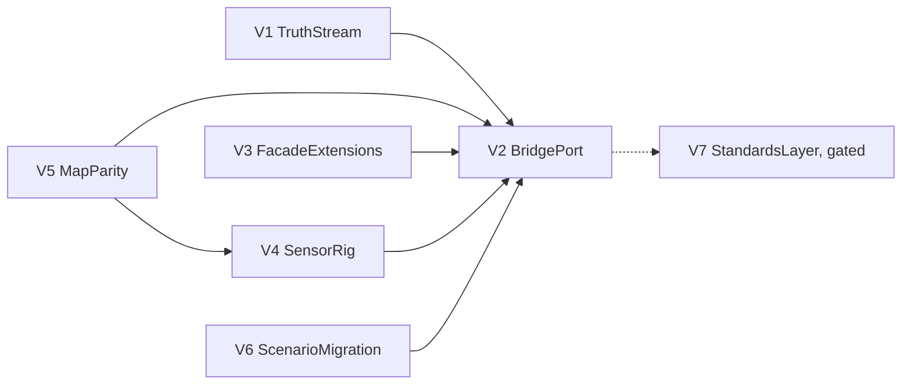

# V2XCarla → UniScenarios Port Plan

Status: proposed 2026-08-22, grounded in read-only scout surveys of
/home/path/V2XCarla (V2XScout) and the UniScenarios capability map
(V2XMapScout). Goal: the digital-twin product runs entirely on the
UniScenarios backend — engine, native renderer, facade — with the CARLA
container retired, while both existing frontends keep working unmodified.

## What V2XCarla actually is (evidence-based)

The active product is a **digital-twin bridge**, not a J2735 stack:
- `digital_twin_bridge.drive_main`: single Python control plane. Sync 20 Hz
  CARLA tick, WebSocket server :8765 — JSON control/telemetry + binary JPEG
  frames (~20 fps), `/world` actor snapshots at 10 Hz, `/twin` calibrated
  fixed-camera streams with live/24h-replay clock, S3 state/map publication.
- Inputs: production HTTP detection API (generic `object_id/type/lat/lon/
  confidence` records from a Kinesis perception service) → mirrored/ghost
  actors in the twin. No BSM/SPaT/MAP encoding anywhere on the active path
  (cdasim/MOSAIC is adjacent, unconnected).
- Features: drive sessions (ego spawn, keyboard/wheel control, RGB stream),
  historical scene reconstruction, GPS-trajectory playback (pure pursuit +
  PID), OpenSCENARIO via patched external ScenarioRunner with clock handoff,
  traffic presets (≤180 vehicles via TrafficManager), user-authored zones +
  moving geofences (CARLA debug-draw), EVA alerts, weather control, ego
  semantic-seg + depth rig at 10 Hz, 4 calibrated Richmond site cameras.
- Frontends: legacy SvelteKit dashboard + new Three.js client that **already
  consumes UniScenarios JS packages** for map assets — the port direction is
  half-travelled.

## Port thesis

Keep the WS 8765 protocol byte-compatible (both frontends untouched), swap
what's underneath: CARLA RPC → `uniscenarios_carla` facade (exists,
wsb7-carla-compat) + explicit extensions; pixels → native Bevy render service
(wsb3/wsb4/wsb5 assets); physics/traffic/scenarios → the deterministic TS
engine; ground truth → one authoritative per-tick snapshot (scene-state.v1 +
a new signal snapshot) fanned out to bridge, renderer, and future V2X
encoders. The facade is a compatibility projection, never the truth source.

## Workstreams

### V1 — TruthStream (foundation)
Engine/env-server work that everything else consumes:
- `signalSnapshotAt(t)` public API on sim-engine's SignalBook: phase, timing
  boundaries (start/end/remaining, next phase, cycle metadata), provenance
  (`program|override`), head/controller/junction bindings, failure states
  (off/flashing) preserved. Engine already computes all of it internally
  (signals.ts); this is observability, not new simulation.
- Live scene subscription on the env-server wire: per-tick scene-state.v1
  (all actor poses/velocities/spawn-despawn — WSB2's frozen schema, which
  currently has emit-from-trace only) + the signal snapshot, as an atomic
  framed-msgpack side-channel beside the RL request/reply. Add per-tick
  acceleration + static actor dims (BSM-grade fields, flagged by scouts).
- Fixes WSB7's known gap (non-ego transforms were perception-derived).

### V2 — BridgePort (the product)
Reimplement `digital_twin_bridge` on UniScenarios, preserving the WS
protocol: drive sessions (spawn ego, VehicleControl passthrough, telemetry),
`/world` 10 Hz snapshots from TruthStream, `/twin` replay clock, historical
scene reconstruction and live detection mirroring (HTTP poller unchanged —
it never touches CARLA), zones/geofences/EVA logic (pure geometry — port
verbatim, replace debug-draw with a frontend overlay message), trajectory
player (pure pursuit/PID against engine dynamics), S3 publication.
Acceptance: both frontends connect to the ported bridge and every WS message
type round-trips on richmond-field-station with no CARLA process running.

### V3 — FacadeExtensions
The facade calls the bridge needs beyond today's coverage matrix: map
list/load, weather parameters, `get_physics_control` (wheelbase/max-steer for
pure pursuit), `set_target_velocity`, ground projection + road-surface Z +
sidewalk lane-type snapping (map-intel/topology-backed), geolocation
transforms matching the legacy flat-earth contract, TrafficManager-shaped
API mapped onto ambient-traffic (presets, seed, spacing, light compliance —
engine feature work where ambient-traffic lacks it).

### V4 — SensorRig (native renderer)
Product camera surface on the wsb3/wsb4/wsb5 stack behind the FrameSource
seam: ego RGB with camera attributes (res/FOV/sensor_tick, attachment
semantics incl. SpringArmGhost), the 4 calibrated Richmond fixed cameras
(exact poses/intrinsics from `twin_camera_rig.py` — visual parity with real
feeds is the acceptance), semantic-seg + depth at 10 Hz in CARLA-compatible
encodings (perception fusion consumes raw layouts), JPEG streaming with
backpressure. Cinematic profile (wsb4) for human-facing streams; sensor
profile for perception.

### V5 — MapParity (highest-risk, start immediately)
Production pins Richmond XODR sha256 `0737f3d9…` (208 roads/32 junctions);
UniScenarios' bundle pins `80704cd1…` (April 2026 RoadRunner export) — same
lineage, **different topology revision**, and the repo itself warns lineages
are not interchangeable. The 4 site-camera calibrations and zone geometries
depend on exact projection (legacy flat-earth actor transform vs proj4 map
placement — an intentional dual-projection contract). Decide once:
(a) ingest the deployed `0737f3d9` XODR as a new Uni map derivative
(map-intel build pipeline exists), or (b) migrate calibrations/zones to the
Uni revision. Deliver a digest-pinned coordinate-contract doc + golden
projection fixtures either way.

### V6 — ScenarioMigration
Retire patched ScenarioRunner: import the `.xosc` scenarios (UniScenarios
`import` exists; firetruck N/S + samples are map-local and small), port
trajectory JSON authoring, map the 5 traffic presets onto ambient-traffic
configs, and re-express EVA firetruck choreography as a catalog template.
Scenario clock handoff disappears — the engine owns time.

### V7 — StandardsLayer (phase 2, explicitly gated)
`adapters/v2x`: BSM (10 Hz from TruthStream), SPaT (from signal snapshot),
J2735 MAP (map-intel topology + XODR georeference, digest-cached), ASN.1
codec boundary, optional cdasim/MOSAIC interop. Not on the active product
path today — build only when a customer/standard requirement lands. The
TruthStream design (V1) already carries every field it needs.

## Sequencing

V1, V3, V4, V5, V6 run in parallel (V5 first among equals — it decides the
coordinate contract V4's calibrations consume); V2 integrates. Depends on
WSB2/WSB5 landing (scene-state runtime, native service) — both in flight.

## Top risks (scout-ranked)
1. OpenSCENARIO/ScenarioRunner replacement breadth (V6) — external process,
   patched BasicAgent, clock ownership.
2. Visual sensor parity (V4) — stubs without pixel parity break drive, twin,
   and perception simultaneously.
3. Traffic/vehicle behavior fidelity (V3) — presets and pure-pursuit assume
   CARLA dynamics and TrafficManager timing.
4. Richmond lineage/projection (V5) — same map name ≠ same network; silent
   calibration breakage.
5. Clock/ownership/lifecycle (V2) — 20 Hz asyncio orchestration, session
   actor auditing, runtime map switching must be redesigned around the
   deterministic engine, not pointed at a socket.

## Non-goals
- No J2735/CDA on the critical path (V7 gated).
- The live V2XCarla service keeps running untouched until V2's acceptance
  passes; the port is built beside it, cut over by switching the frontends'
  WS endpoint.
